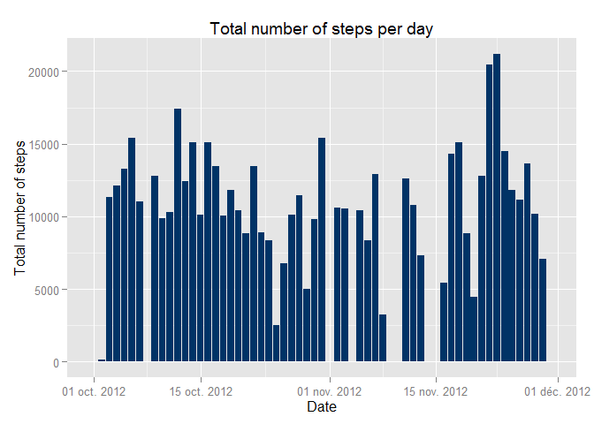
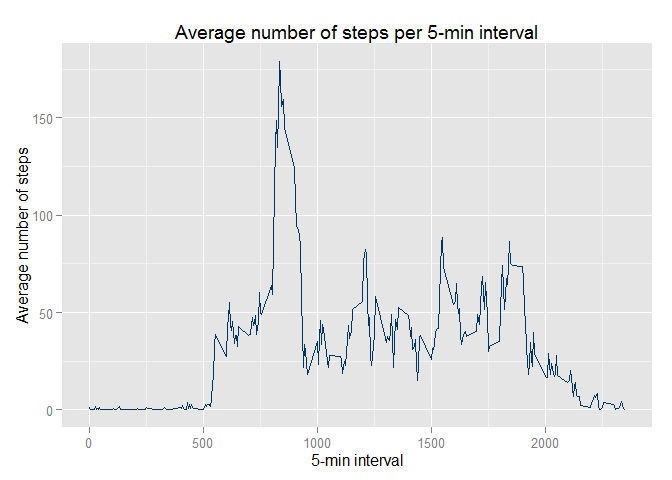
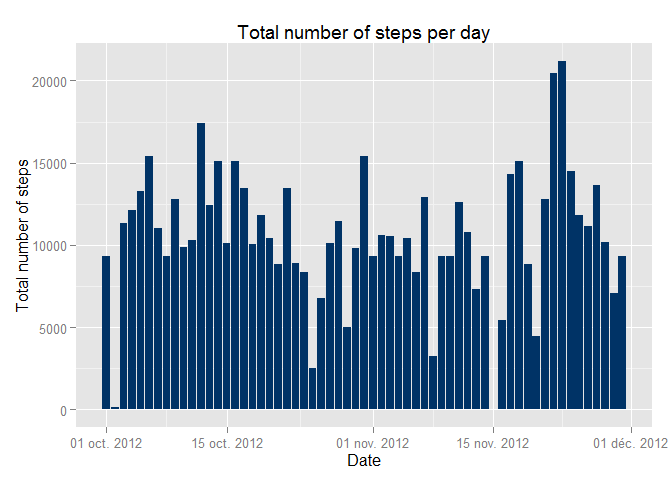
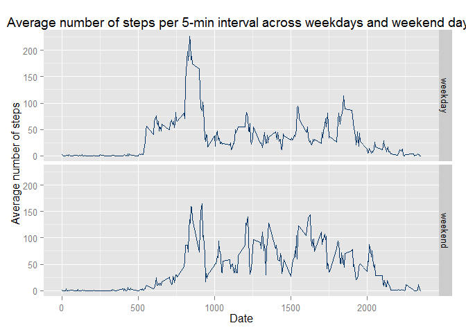

# Reproducible Research: Peer Assessment 1
Vincent CANUEL  
Saturday, August 16, 2014  

## Loading and preprocessing the data
We first load the required packages :

```r
library(ggplot2)
library(scales)
library(plyr)
```

After forking/cloning the given GitHub repository, we unzip and load the activity data provided : 

```r
# Unzipping file
unzip("activity.zip")
# Reading the CSV
activity <- read.csv("activity.csv", stringsAsFactors = FALSE, colClasses = c("integer", "Date", "integer"))
# Checking number of rows and columns against expected values
nrow(activity) == 17568
```

```
## [1] TRUE
```

```r
ncol(activity) == 3
```

```
## [1] TRUE
```

```r
# Summary of data
summary(activity)
```

```
##      steps            date               interval   
##  Min.   :  0.0   Min.   :2012-10-01   Min.   :   0  
##  1st Qu.:  0.0   1st Qu.:2012-10-16   1st Qu.: 589  
##  Median :  0.0   Median :2012-10-31   Median :1178  
##  Mean   : 37.4   Mean   :2012-10-31   Mean   :1178  
##  3rd Qu.: 12.0   3rd Qu.:2012-11-15   3rd Qu.:1766  
##  Max.   :806.0   Max.   :2012-11-30   Max.   :2355  
##  NA's   :2304
```

## What is mean total number of steps taken per day?
We first get the total number of steps per day using the `plyr` package. 

```r
# Total number of steps per day
# The variable tsteps will be created and populated with the total number of steps for each date
stepsdate <- ddply(activity, 'date', summarise, tsteps = sum(steps, na.rm = TRUE))
```

Here is a glimpse of the dataframe produced, `stepsdate` :

```r
head(stepsdate)
```

```
##         date tsteps
## 1 2012-10-01      0
## 2 2012-10-02    126
## 3 2012-10-03  11352
## 4 2012-10-04  12116
## 5 2012-10-05  13294
## 6 2012-10-06  15420
```

Then we can plot this data using the `ggplot2` package.

```r
# Creating an histogram with axis x = date and y = tsteps
# The scale_x_data function is used to format date the following way : day month year
# The stats="identity" is used to indicate we want to plot the value of tsepts
ggplot(stepsdate, aes(x = date, y = tsteps)) + geom_histogram(stat="identity", fill="#003366") + scale_x_date(label = date_format("%d %b %Y")) + labs(title="Total number of steps per day" , x="Date", y="Total number of steps")
```

 

Having the total number of steps per day in the `stepsdate` object, we can now easily compute the **mean** and **median** number of steps :

```r
# Mean value of tsteps
mean(stepsdate$tsteps, na.rm = TRUE)
```

```
## [1] 9354
```

```r
# Median value of tsteps
median(stepsdate$tsteps, na.rm = TRUE)
```

```
## [1] 10395
```

The mean number of steps is : 9354.2295  
The median number of steps is : 10395

## What is the average daily activity pattern?
Using the same `plyr` package, we can now calculate, for each 5-min interval, the total number of steps.  
This value is divided by the total number of days (61) to get the average number of steps per 5-min interval.

```r
# Average number of steps per interval
# The variable asteps will be created and populated with the average number of steps for each interval (averaged across all days)
stepsinterval <- ddply(activity, "interval", summarise, asteps = sum(steps, na.rm = TRUE)/61)
```

Here is a glimpse of the dataframe produced, `stepsinterval` :

```r
head(stepsinterval)
```

```
##   interval  asteps
## 1        0 1.49180
## 2        5 0.29508
## 3       10 0.11475
## 4       15 0.13115
## 5       20 0.06557
## 6       25 1.81967
```

We can now plot the average number of steps per 5-min interval, using the `ggplot2` package :

```r
# Creating an histogram with axis x = interval and y = asteps
# The stats="identity" is used to indicate we want to plot the value of tsepts
ggplot(stepsinterval, aes(x = interval, y = asteps)) + geom_line(stat="identity", color="#003366") + labs(title="Average number of steps per 5-min interval" , x="5-min interval", y="Average number of steps")
```

 

We can now find the 5-min interval with the highest number of steps 

```r
# Get the maximum number of steps per 5-min interval :
maxSteps <- max(stepsinterval$asteps)

# Get the corresponding 5-min interval
stepsinterval$interval[stepsinterval$asteps == maxSteps]
```

```
## [1] 835
```

The 5-min interval number **835** is the one with the **highest number of steps, in average**, across all days (with an average of 179.1311 steps)


## Imputing missing values
Multiple rows have missing value for the `steps` variable. We first need to check how many rows are concerned :

```r
# We check if the value of steps is NA, and tabulate the results
# TRUE = number of rows where the value of step is missing
table(is.na(activity$steps))
```

```
## 
## FALSE  TRUE 
## 15264  2304
```
**2304** rows have missing value (`NA`) for the `steps` variable.

For all the 5-min intervals where the number of steps value is NA, we can replace these missing value with the average number of steps calculated across all days (i.e. if the number of steps for the interval X of day Y is missing, we replace the missing value by the average number of steps for the interval X )

To do so, we merge the `stepsinterval` dataframe and the original `activity` dataframe, to create a new dataset whitout any missing value.

```r
# Merging dataframe
activityNA <- merge(activity, stepsinterval)
                   
# Replacing NA values with the corresponding average
naValue <- is.na(activityNA$steps)
activityNA$steps[naValue] <- activityNA$asteps[naValue]

# Drop the asteps variable
activityNA <- activityNA[,-4]
```

Now that missing values are replaced, we can perform the same analysis all over again :  

```r
# Average number of steps per interval
# The variable asteps will be created and populated with the average number of steps for each interval (averaged across all days)
stepsdateNA <- ddply(activityNA, 'date', summarise, tsteps = sum(steps))

# Creating a time series plot with axis x = interval and y = asteps
# The stats="identity" is used to indicate we want to plot the value of tsepts
ggplot(stepsdateNA, aes(x = date, y = tsteps)) + geom_histogram(stat="identity", fill="#003366") + scale_x_date(label = date_format("%d %b %Y")) + labs(title="Total number of steps per day" , x="Date", y="Total number of steps")
```

 

```r
# Mean value of tsteps
mean(stepsdateNA$tsteps)
```

```
## [1] 10581
```

```r
# Median value of tsteps
median(stepsdateNA$tsteps)
```

```
## [1] 10395
```

After replacing the missing value, The mean number of steps is now : 1.0581 &times; 10<sup>4</sup>  
And the median number of steps is now : 1.0395 &times; 10<sup>4</sup>

We note that the **median number of steps is not modified**. Since missing values for 5-min intervals were replaced with average number of steps, the minimum/maximum values were not modified. Therefore, the median value is left unchanged.  
We can also note that the **mean number of steps increased**. By replacing missing values with average number of steps, we did modify the mean value, since it depends on the value of **all** the observations (not just the minimum/maximum values)


## Are there differences in activity patterns between weekdays and weekends?
To spot a difference in activity patterns, we must first categorize our observations in two group : `weekday` vs `weekend`

```r
# Create the weekday variable
# We categorize the results of the weekday() function in two groups
# In French, "samedi" stands for "saturday" and "dimanche" stands for "sunday"
activityNA$weekday <- ifelse(weekdays(activityNA$date) %in% c("samedi", "dimanche"), "weekend", "weekday")
```

Now that all days are categorized in "weekday/weekend", we can can calculate the average number of steps for all intervals. These values are then averaged in each group, to account for the number weekdays/weekends days.

```r
# Create the dataframe with total number of steps per interval and type of day (weekdays/weekend days)
stepsintervalNA <- ddply(activityNA, .(interval, weekday), summarise, asteps = sum(steps))

# We get the number of weekdays / weekend days in the dataset
# stepsintervalNA is an aggregated dataframe, we need to use the activityNA dataframe to calculate these values
typeofday <- table(unique(activityNA[,c(3,4)])$weekday)
typeofday
```

```
## 
## weekday weekend 
##      45      16
```

```r
# We can now replace total values with average values
# Values for weekdays are divided by the total number of weekdays, values for weekends are divided by the total number of weekend days 
stepsintervalNA$asteps <- ifelse(stepsintervalNA$weekday=="weekday", stepsintervalNA$asteps/typeofday[[1]], stepsintervalNA$asteps/typeofday[[2]])
```

We can now plot the data : 

```r
# Creating two time series plot with axis x = interval and y = asteps, one for the "weekday" value, the other one for the "weekend" value
# The stats="identity" is used to indicate we want to plot the value of tsepts
ggplot(stepsintervalNA, aes(x = interval, y = asteps)) + geom_line(stat="identity", color="#003366") + labs(title="Average number of steps per 5-min interval across weekdays and weekend days" , x="Date", y="Average number of steps") + facet_grid(weekday ~ .)
```

 
